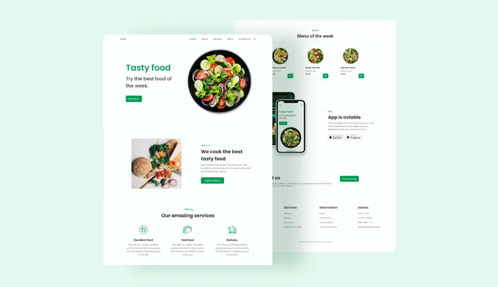

# GreenEats - Eat Healthy, Live Healthy 🌱

Welcome to **GreenEats**, your one-stop platform for purchasing healthy meals. Our mission is to provide delicious, nutritious food that promotes a healthy lifestyle.

---

## Features 🚀
- **Wide Selection**: Choose from a variety of healthy meals tailored to your needs.
- **Easy Navigation**: Intuitive interface for seamless browsing.
- **Responsive Design**: Optimized for all devices.
- **Customizable Orders**: Personalize your meals according to your preferences.

---

## Getting Started 🔧

### 1. Download the Files
- Clone the repository or download the ZIP file:
```bash
git clone https://github.com/YourUsername/GreenEats.git
```

### 2. Open the Project
- Unzip the file (if downloaded as a ZIP).
- Open the `index.html` file in your browser to view the website.

---

## How to Use 🛠️

1. **Browse Meals**:
   - Explore a variety of healthy meal options.
2. **Add to Cart**:
   - Use the interactive buttons to add your desired items to the cart.
3. **Customize Orders**:
   - Modify your meal preferences using available options.

---
## Web Link :

## Screenshots 🖼️
### Home Page:


---

## YouTube Video 📹
Check out our YouTube video showcasing the features of GreenEats:

[](https://www.youtube.com/watch?v=YOUR_VIDEO_ID)

---

## Technologies Used 💻
- **Frontend**: HTML, CSS, JavaScript

---

## Contributing 🤝
We welcome contributions to make GreenEats even better! Follow these steps:

1. Fork the repository.
2. Create a new branch for your feature or bugfix:
   ```bash
   git checkout -b feature/YourFeatureName
   ```
3. Commit your changes:
   ```bash
   git commit -m "Add Your Feature Description"
   ```
4. Push to your branch:
   ```bash
   git push origin feature/YourFeatureName
   ```
5. Open a pull request.

---

## License 📜
This project is licensed under the MIT License. See the [LICENSE](LICENSE) file for details.

---

## Contact 📧
- **Youtube**: [@CodeCraftDL](https://www.youtube.com/@CodeCraftDL)
- **Instagram**: [@CodeCraftDL](https://instagram.com/ddos_attack_co)

Stay connected and eat healthy! 🌱
